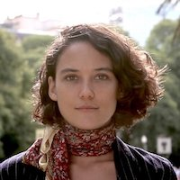
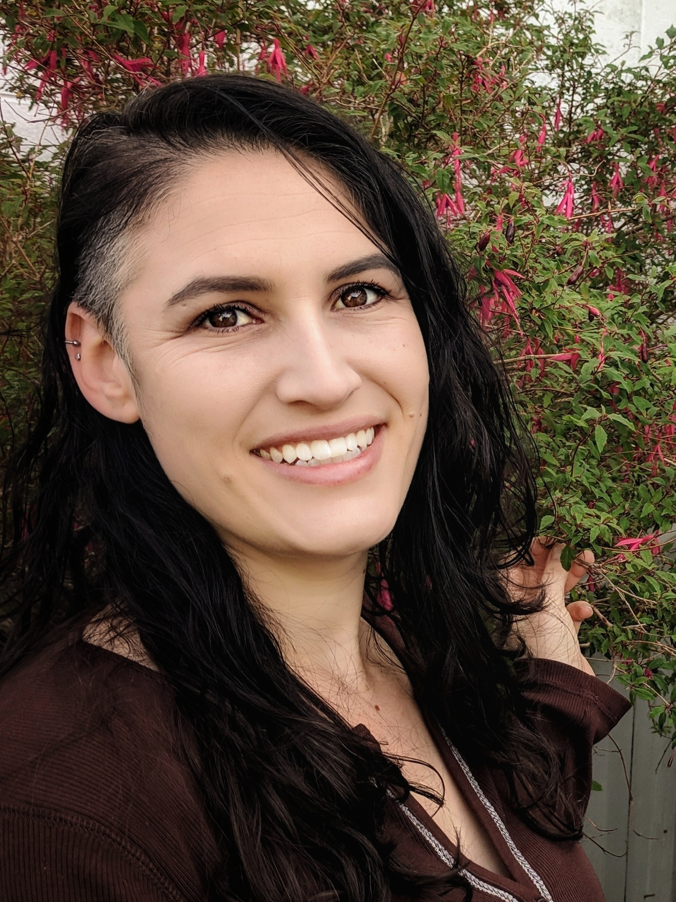
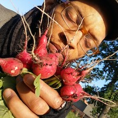
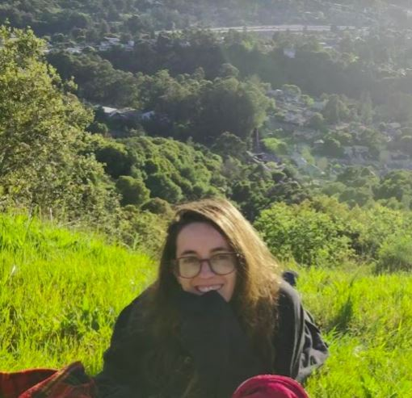

# Team

Open Collective Foundation (OCF), while primarily focused on supporting US-based projects, is supported by an international, collaborative team. Many members of our team work not only with Open Collective Foundation, but with [Open Source Collective](https://www.oscollective.org) and elsewhere in the [Open Collective](https://www.opencollective.com) network.

* **Founding Director:** Pia Mancini - [Twitter](https://twitter.com/piamancini), [LinkedIn](https://www.linkedin.com/in/piamancini/)
* **Executive Director:** Alanna Irving - [Website](http://alanna.space), [Linkedin](https://www.linkedin.com/in/alannairving83/)
* **Program Staff:**
  * Mike Strode - [Linkedin](https://www.linkedin.com/in/mjstrode/)
  * Caroline Woolard - [Website](https://carolinewoolard.com/past), [Linkedin](https://www.linkedin.com/in/carolinewoolard/)
  * Nathan Hewitt - [Website](https://natehn.com), [Linkedin](https://www.linkedin.com/in/nthnh/)
* **Support Staff:**
  * Alina Manko - [Twitter](https://twitter.com/c\_observations)[, Instagram](https://www.instagram.com/curious\_observations/), [LinkedIn](https://www.linkedin.com/in/alinamanko/)
  * Kayla Epstein - [Blog](https://blog.opencollective.com/author/kayla/), [LinkedIn](https://www.linkedin.com/in/kaylarepstein/)
  * Ember Buck - [Website](https://ewhitneybuck.wordpress.com), [LinkedIn](https://www.linkedin.com/in/emberbuck/)
* **Communications Organizer**
  * Sadé Swift - [Website](https://cardsbyde.com/our-team)
  * Alfie Marsland - [Design](https://althemiamarsland.com/)

### **Team Bios:**

**Pia Mancini (Madrid, Spain):** Pia is co-founder & CEO at Open Collective, as well as Chair of DemocracyEarth Foundation, a democracy activist, and an open-source sustainer. She worked in politics in Argentina and developed technology for democracy around the world. She's a YC Alum, YGL (World Economic Forum), globe-trotter, and Roma's mum.

**Alanna Irving (Wellington, New Zealand):** Alanna Irving builds open source tools and communities for radical participation and collaboration. She co-founded [**Enspiral**](http://enspiral.com), [**Loomio**](http://loomio.org), [**Cobudget**](http://cobudget.co), the [**Open Source // Open Society**](http://opensourceopensociety.com) conference, and [**Dark Crystal**](http://darkcrystal.pw). She co-authored the book [**Better Work Together**](http://betterworktogether.co). Originally from San Francisco, she lives in Wellington, NZ with her partner, children, and little black cat. More info: [**https://alanna.space**](https://alanna.space).

**Mike Strode (Chicago, IL):** Mike Strode is a writer, urban cyclist, facilitator, and solidarity economy organizer with the Kola Nut Collaborative residing in southeast Chicago. The Kola Nut Collaborative is Chicago’s only time-based service and skills exchange (otherwise known as a timebank) providing an open platform for mutual aid, community organizing, and network weaving. Prior to launching the Collaborative, he worked with Black Oaks Center for Sustainable Renewable Living to develop the Healthy Food Hub, a food sovereignty Collective which connects farmers in the historically Black farming community of Pembroke Township to food insecure communities throughout Chicago. The Collaborative recently launched their newest Collective to develop a network of Chicago-based facilitators trained in a method known as the Offers and Needs Market in order to embed this resource sharing practice within local organizations. He also serves on the boards of Dill Pickle Food Co-op, South Deering Manor Community Association, US Solidarity Economy Network, and Co-op Power.

.png>)

**Caroline Woolard (Berlin, Germany):** Caroline Woolard (she/her/hers) is a six foot tall researcher, collaborator, and connector. As Director of Research and Partnerships at Open Collective Foundation, Caroline brings over a decade of experience working on cutting-edge technology for cooperative culture in New York City. Caroline’s work includes co-creating objects, events, and networks such as an international peer-learning and barter network ([TradeSchool.coop](https://tradeschool.coop), 2009-2019), a cultural equity advocacy group ([BFAMFAPhD.com](http://bfamfaphd.com), 2013-present), and a cultural solidarity economy platform ([Art.coop](https://art.coop), 2021, with Nati Linares). Caroline Woolard is the co-author of three books: [Making and Being](https://makingandbeing.com) (Pioneer Works, 2019), a book for educators about interdisciplinary collaboration, co-authored with Susan Jahoda; [Art, Engagement, Economy](https://www.onomatopee.net/exhibition/caroline-woolard/#publication\_13011) (onomatopee, 2020) a book about managing socially-engaged projects; and [TRADE SCHOOL](https://tradeschool.coop): 2009-2019. Caroline is a tenure-track Assistant Professor of Foundations at Pratt Institute, an AmbitioUS Fellow, and a member of the Guild of Future Architects.

**Nathan Hewitt (Queens, New York):** Nathan Hewitt (he/him) is a nonprofit worker, fiscal sponsorship nerd, and radical administrator fascinated by solidarity-based community decisionmaking processes and governance structures. He previously worked with a major US fiscal sponsor as well as in small business operations, grantwriting, theatre administration, community arts programming, and noncommercial radio. Also a musician and activist, Nathan is based in Queens, New York.

**Alina Manko (Wellington, New Zealand):** Weaving together her process-orientated mind with a genuine joy of connecting with the wonderful community we are part of, her role is strongly focused on operations as well as supporting the Collectives OCF hosts, to help them to make the most of their Open Collective experience. After years spent in a more traditional work setting, the last few years of her working life were spent on deliberately finding herself collaborating with people and projects making an actual difference and connecting people.

**Kayla E (Davis, CA):** has been very fortunate to have travelled, worked, and volunteered in many parts of the world. Her professional background ranges through customer service, teaching, hospitality, landscaping, and lots more. At the end of the day, she simply seeks to help people who help people (and plants, animals, the earth), and she is very excited to be able to support the open source and solidarity economy movements. She tries not to take life too seriously, but is not very good at that.

**Ember Buck (Tucson, Arizona):** Ember is a queer border activist with a passion for literature, alternative family-building, futurism and space exploration. They have traveled to all continents save Antarctica and have worked across myriad sectors to support locally-led activist and humanitarian Collectives to launch, scale, and increase reach and impact, doing things like grant writing, group facilitation, event coordination and impact reporting. They live with their partner and really cool baby.

If you are interested in joining the team, check our [Hiring page](https://opencollective.com/hiring) or [get in touch](mailto:support@opencollective.com).
