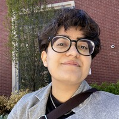

# Team

**Pia Mancini (Madrid, Spain), co-founder and president**&#x20;

Pia is co-founder & CEO at Open Collective, as well as Chair of DemocracyEarth Foundation, a democracy activist, and an open-source sustainer. She worked in politics in Argentina and developed technology for democracy around the world. She's a YC Alum, YGL (World Economic Forum), globe-trotter, and Roma's mum. [Twitter](https://twitter.com/piamancini), [LinkedIn](https://www.linkedin.com/in/piamancini/)

********

**Alanna Irving (Wellington, New Zealand), executive director**

Alanna Irving explores bossless leadership, open-source org dev, cooperative governance, participatory technology, impact entrepreneurship, and collaborating with money—for a radically optimistic future. She previously co-founded [Enspiral](http://enspiral.com), [Loomio](http://loomio.com), and [Cobudget](http://cobudget.com), is an [Edmund Hilary Fellow](http://ehf.org), and co-authored the book [Better Work Together](http://betterworktogether.co). Her ultimate dream is to make a utopian Star Trek future a lived reality for everyone. [Website](http://alanna.space), [Linkedin](https://www.linkedin.com/in/alannairving83/)

********

**Mike Strode (Chicago, USA), program manager**

Mike Strode is a writer, urban cyclist, facilitator, and solidarity economy organizer with the [Kola Nut Collaborative](https://www.kolanutcollab.org) residing in southeast Chicago. The Kola Nut Collaborative is Chicago’s only time-based service and skills exchange (otherwise known as a timebank), providing an open platform for mutual aid, community organizing, and network weaving. Prior to launching the Collaborative, he worked with [Black Oaks Center for Sustainable Renewable Living](https://www.blackoakscenter.org) to develop the [Healthy Food Hub](https://www.healthyfooodhub.org), a food sovereignty initiative which connects farmers in the historically Black farming community of Pembroke Township to food insecure communities throughout Chicago. The Collaborative recently launched their newest Collective to develop a network of Chicago-based facilitators trained in a method known as the Offers and Needs Market in order to embed this resource-sharing practice within local organizations. He also serves on the boards of [Dill Pickle Food Co-op](https://www.dillpickle.coop), [South Deering Manor Community Association](https://www.sdmanor.org), [US Solidarity Economy Network](https://www.ussen.org), and [New Economy Coalition](https://www.neweconomy.net). [Linkedin](https://www.linkedin.com/in/mjstrode/)

********

**Caroline Woolard (Berlin, Germany), Dir. Research & Partnerships**

Caroline Woolard (she/her/hers) is a six foot tall researcher, collaborator, and connector. As Director of Research and Partnerships at Open Collective Foundation, Caroline brings over a decade of experience working on cutting-edge technology for cooperative culture in New York City. Caroline’s work includes co-creating objects, events, and networks such as an international peer-learning and barter network ([TradeSchool.coop](https://tradeschool.coop), 2009-2019), a cultural equity advocacy group ([BFAMFAPhD.com](http://bfamfaphd.com), 2013-present), and a cultural solidarity economy platform ([Art.coop](https://art.coop), 2021, with Nati Linares). Caroline Woolard is the co-author of three books: [Making and Being](https://makingandbeing.com) (Pioneer Works, 2019), a book for educators about interdisciplinary collaboration, co-authored with Susan Jahoda; [Art, Engagement, Economy](https://www.onomatopee.net/exhibition/caroline-woolard/#publication\_13011) (onomatopee, 2020) a book about managing socially-engaged projects; and [TRADE SCHOOL](https://tradeschool.coop): 2009-2019. Caroline is a tenure-track Assistant Professor of Foundations at Pratt Institute, an AmbitioUS Fellow, and a member of the Guild of Future Architects. [Website](https://carolinewoolard.com/past), [Linkedin](https://www.linkedin.com/in/carolinewoolard/)

********

**Kayla E (Oakland, USA), support staff**

Kayla has been very fortunate to have travelled, worked, and volunteered in many parts of the world. Her professional background ranges through customer service, teaching, hospitality, landscaping, and lots more. At the end of the day, she simply seeks to help people who help people (and plants, animals, the earth), and she is very excited to be able to support the open source and solidarity economy movements. She tries not to take life too seriously, but is not very good at that. [Blog](https://blog.opencollective.com/author/kayla/), [LinkedIn](https://www.linkedin.com/in/kaylarepstein/)

********

**Ember Buck (Wellington, New Zealand), support staff**&#x20;

Ember is a queer border activist with a passion for literature, alternative family-building, futurism and space exploration. They have traveled to all continents save Antarctica and have worked across myriad sectors to support locally-led activist and humanitarian Collectives to launch, scale, and increase reach and impact, doing things like grant writing, group facilitation, event coordination and impact reporting. They live with their partner and really cool baby. [Website](https://ewhitneybuck.wordpress.com), [LinkedIn](https://www.linkedin.com/in/emberbuck/)

********

**Sadé Swift (New York, USA), communications organizer**

Sadé Swift is a Black Queer artist who has been organizing for the last 10+ years. They love bridging the gap between communications and community which was how they landed at the Open Collective Foundation, by way of beautiful work they did with art.coop last year. Sade is a proud worker-owner and co-founder of two worker-owned cooperative businesses, [Cards by De](https://cardsbyde.com/), a stationery cooperative and [Rebellious Root,](https://www.rebelliousroot.com/) a consulting cooperative working towards justice and social change through training, curriculum design and intentional conversations. They are dedicated to building an abolitionist cooperative future with intention, community, and love. [Website](https://cardsbyde.com/our-team), [Linkedin](https://www.linkedin.com/in/sad%C3%A9-swift-773352253/)

********

**Alfie Marsland (Baltimore, USA), designer**

Alfie is a queer artist and graphic designer, and their love for visual communication brought them to this very position. They love working for OCF because the graphic design practice they want belongs outside the setting of a commercial consumer realm. With OCF they get to produce graphic design that has a strong social impact. [Website](https://althemiamarsland.com/), [Instagram](https://www.instagram.com/alfie.marsland/)

<figure><figcaption></figcaption></figure>

**Salwa R (New York, USA), support staff**

Salwa comes to us from being Operations Manager at Drivers Cooperative, a startup platform cooperative. Their career trajectory began from a childhood rooted in community organizing in the South Asian communities of South Florida. They are grounded in worker solidarity and collective care.

<figure><figcaption></figcaption></figure>

**Dawn Matlak (Madison, USA), Operations Coordinator**

Dawn (they/them) loves to talk about money, specifically redistributing & accounting for it. Their work is driven by deep ethics of care in our relationships and communities, which often disrupts concepts of professionalism and capitalism in workspaces. Dawn began learning collective, nonprofit, & cooperative business finances 11 years ago, with the intention of managing the tasks that many shy away from in movement work. They recently came to OCF after working for Diverse & Resilient and Public Allies Milwaukee.

<figure><figcaption></figcaption></figure>

**Katie Adamides (Rochester, USA), director of operations**

Katie (she/they) is an activist with an openness to new tools that led them to become a lawyer, policy advocate, and eventually, nonprofit leader. They want to use their career to share power with fellow activists struggling for a better future. Before returning to her hometown of Rochester, Katie lived and worked in Dinétah (Navajo Nation), the San Francisco Bay Area, Los Angeles, and New York City. To learn more about Katie's journey to nonprofit leadership, check out her[ interview with Cal Alumni Magazine](https://alumni.berkeley.edu/california-magazine/2022-spring/snapp-chats/). [LinkedIn](http://linkedin.com/in/katie-adamides-424b0915)

\-------

If you are interested in joining the team, check our [Hiring page](https://opencollective.com/hiring) or [get in touch](mailto:support@opencollective.com).
