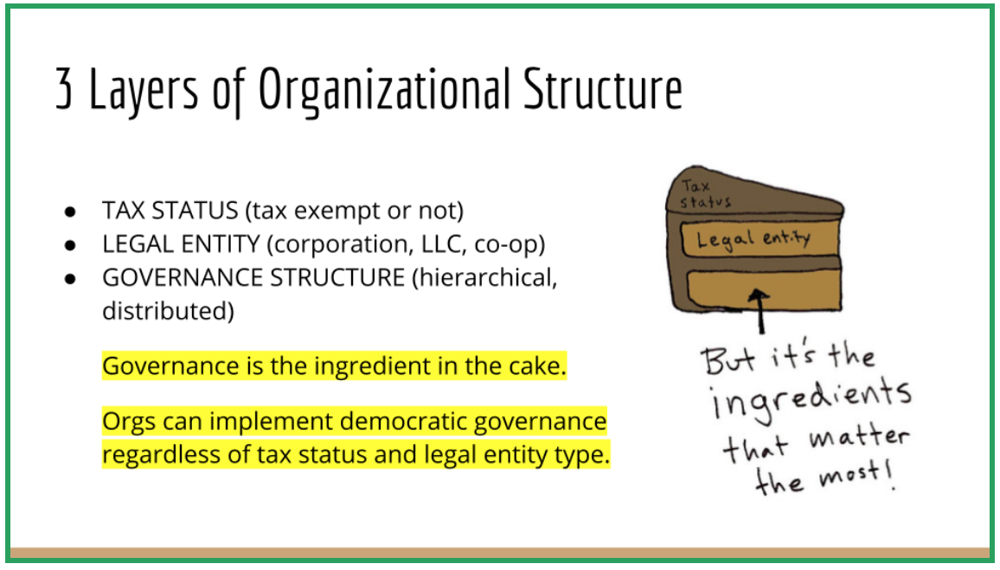

# Is OCF Right For You?

An initiative considering joining OCF had a lawyer do a formal review of whether it would be a good fit, which resulted in a very useful list of things all prospective initiatives might wish to consider.&#x20;

We feel sharing this analysis openly can benefit all parties, as it's an objective and impartial in-depth review. Everyone is better off if initiatives understand what joining OCF entails, and we are happy to refer projects to alternatives if OCF is not the best fit for them.

This particular initiative ended up deciding to join OCF and it worked out great, but each initiative is unique.&#x20;

## Model A Fiscal Sponsorship Model

OCF offers "Model A" fiscal sponsorship, also known as a "comprehensive" or "direct" fiscal sponsor agreement.&#x20;

### OCF in the Driver's Seat

Under Model A, the sponsor organization is in the driver’s seat. This is the kind of fiscal sponsorship where the sponsored project has the least amount of financial control.&#x20;

In Model A, the sponsor organization (OCF) is not just an administrator who receives money, issues receipts and checks, and handles paperwork; from a tax and legal perspective, in Model A, the heart of fiscal sponsorship (and the reason contributions to the initiative are tax deductible) is that the sponsor organization (OCF) maintains its own nonprofit charitable purposes, which it furthers by operating initiatives that become essentially their own charitable projects.&#x20;

Under Model A, the initiative has no legal identity separate from the sponsor organization (OCF). The sponsor organization (OCF) is both fiscally and legally liable for the actions of the initiative. The sponsor organization (OCF) must exercise significant control over the initiative's actions and funding in order to safeguard itself from legal liability and losing its nonprofit, tax-exempt status. Because initiative assets and liabilities are those of OCF, OCF is responsible for the oversight of all funds. In OCF's words, "As the fiscal host, we hold our initiatives’ funds in our bank account and are responsible for taxes, accounting, legal compliance, and financial administration."

Under the Model A agreement, if an initiative buys equipment, furniture, buildings, land, or other tangible assets, they belong to OCF. However, in its terms of fiscal sponsorship agreement, OCF specifically disclaims rights to intellectual property, unless initiatives request OCF take ownership of it for them.

From OCF's terms:

_As between the parties, Initiative shall retain all right, title, and interest in any intellectual property of the Initiative, including any copyrights, trademarks, trade names, artwork, designs, logos, copy, and all other intellectual property (collectively, “Intellectual Property”).The Foundation acknowledges and agrees that, absent any separate agreement to the contrary, any Intellectual Property provided to the Foundation by the initiative or its agents for inclusion in the Initiative shall not thereby be transferred to the Foundation. Notwithstanding the above, Initiative may separately agree to transfer assets, including Intellectual Property and physical property, to the Foundation to be held for the benefit of the Initiative. Any such transferred assets (“Other Assets”) shall become the property of the Foundation._

### Restrictions on Mission and Work

As a sponsored project of OCF, there are many restrictions on your activities. This is a significant consideration to hold when you embark on the work of articulating your governance model. &#x20;

1. You must inform OCF if your mission or activities change from what you submitted in your original fiscal sponsor application.&#x20;
2. If you are engaging in political lobbying, you must ensure you are abiding by the IRS’s limitations on political activity for 501(c)(3) organizations ( see [OCF's related policies](../how-it-works/policies/political-activity.md)).
3. Because sponsored projects and sponsor organizations are part of the same legal entity, sponsored projects are ultimately governed by the sponsor's board of directors.

OCF's control over its initiatives has both advantages and disadvantages, as set forth below.&#x20;

#### For further information, see:

* [OCF's documentation about fiscal sponsorship](../what-we-offer/fiscal-hosting.md)
* [Fiscal Sponsorship: Six Ways To Do It Right](https://www.adlercolvin.com/fiscal-sponsorship-six-ways-to-do-it-right-a-synopsis/) (page 605)
* [Fiscal Sponsorship: A Balanced Overview](https://nonprofitquarterly.org/fiscal-sponsorship-a-balanced-overview/)
* [What is Fiscal Sponsorship?](https://www.adlercolvin.com/blog/2012/10/15/what-is-fiscal-sponsorship/)&#x20;
* [A White Paper on Comprehensive Fiscal Sponsorship](https://www.tsne.org/sites/default/files/White-Paper-Fiscal-Sponsorship.pdf)

## Advantages

### Reasonable fees

OCF charges a fee on all funds raised by its sponsored projects, which is standard practice in the fiscal sponsorship world. For groups who have raised up to $500k, OCF charges:

* 5% fee on each incoming contribution made via credit card or PayPal through your page on Open Collective (plus payment processor fees).&#x20;
* 8% via all other means (e.g. bank transfers and checks).&#x20;

Fiscal sponsorship fees in the field range from 5%-15%, so OCF's fees are on the low end.&#x20;

### OCF handles all tax reporting &#x20;

Under Model A fiscal sponsorship, the sponsor directly receives donations and grants for the project, and reports receipts and use of all project funds on the sponsor’s tax filings. All tax reporting for the project thus is done by the sponsoring organization.&#x20;

Open Collective Foundation must collect tax forms (W9s, for example) for any individual who invoices OCF for payment over $600 in a year. (This does not apply to reimbursements). OCF will then issue those individuals a 1099. ([More info](broken-reference)).

This means that OCF will report all grants and donations received on OCF's own form 990. Initiatives need not file end of year taxes for their financial activity.

### **Ease of exit**

If an initiative decides to form its own separate legal entity, it will be easy to exit your fiscal sponsorship agreement with OCF.  You simply must, according to Provision 6 of the fiscal sponsorship agreement, give OCF 30 days notice.

Your choices for any remaining assets are:

1. Spend the money through submitting expenses
2. Find or form another organization that OCF is allowed to transfer assets to—usually this will need to be another 501(c)(3)
3. Donate them to another initiative under OCF, or to OCF itself

Notably, because money donated to a 501(c)(3) nonprofit organization cannot be transferred to a for-profit entity or an individual, "in almost all cases OCF can only move an Initiative’s funds to another 501(c)(3) entity". This restriction is very important to keep in mind because if you become a new legal entity that does not have tax-exempt status, you might not be able to transfer assets in your OCF account to the new entity.

### OCF sends charitable gift receipts to all donors

Clause B of your fiscal sponsorship agreement states that OCF will provide donors with acknowledgement of charitable contributions, otherwise known as charitable gift receipts, for their tax records. Legally, it is generally required for a nonprofit to provide donors with charitable gift receipts, especially for gifts over $250.

## Disadvantages

### Banking restrictions

Any funds you raise must be deposited into your account with OCF. All checks must be made out to Open Collective Foundation. You may not directly receive tax deductible charitable contributions or deposit any funds raised into a bank account separate from your OCF account.&#x20;

OCF's Terms of Fiscal Sponsorship state:

_6. In the event that Sponsee receives funding outside of the Platform (that which does not go directly into the Fund), Sponsee will immediately transfer such funds to Sponsor for deposit into Sponsee’s Fund; at no time shall Sponsee hold any funds for the Initiative outside of the Fund or utilize the services of any other fiscal sponsor during the Term of this Agreement._ &#x20;

OCF has an exception to this rule as follows:

_You can maintain another bank account for other projects and activities that may be somewhat related. They need to be fully distinct, with different names and purposes, and funds must remain completely separate. Money cannot be regularly flowing back and forth between the two accounts/entities. You will also need to define a very clear scope for your Open Collective funding and activities that is fully separated from any other ones._

Relatedly, under OCF's [Outside Entities Policy](../how-it-works/policies/outside-entities-policy.md) you may not:

* Use funds for the private benefit of for profit entities or individuals
* Move money through OCF out to another entity and manage operational expenses from that outside entity&#x20;
* Represent that contributions to an outside entity are donations to charity or are tax deductible based on OCF’s 501(c)(3) status (only direct donations to OCF qualify for tax deductions).

These financial restrictions are both good and bad: you don't have to deal with the labor of processing and holding funds, but at the same time, you pay a price for OCF to do this labor, in the form of your sponsorship fees.&#x20;

Some donors may be confused by the requirement that all checks must be made out to Open Collective Foundation. It's therefore important in your communications with donors to make clear what your relationship with OCF is.

The [Outside Accounts Policy](../how-it-works/policies/outside-accounts-policy.md) places rules and restrictions around how OCF initiatives may use external fundraising and payment platforms and accounts.

### Restrictions on fundraising and regranting

If your initiative submits a grant application as Open Collective Foundation, OCF may need to review the grant application. Likewise, any and all grant agreements need to be signed by an authorized OCF staff member. Once you receive a grant contract, you must send it to OCF or ask the funder to send it to OCF directly.

Additionally, according to Clause 3C of your fiscal sponsorship agreement, you must let OCF know about any in-person fundraising events (because sometimes 501c3s are required to register such fundraising events depending on the state). This requirement does not apply to on-line/virtual events. &#x20;

In addition, OCF requires you to reach out to them if you engage in any of the following financial activity (to discuss logistical considerations and sure policy compliance):&#x20;

* If you want to [make grants](../how-it-works/policies/grantmaking-policy.md) and/or provide [cash assistance](https://docs.opencollective.foundation/how-it-works/processes-and-limitations/cash-assistance-policy);
* If you engage in offline or in-person fundraising;
* If you want to use an external service or platform to receive funds (e.g. Kickstarter, Patreon);
* If you want to sell goods or services, or provide anything tangible in return to someone giving you money (i.e. it’s not purely a donation);
* If you receive an in-kind/non-monetary donation.

### Required review of all contracts with third parties &#x20;

According to Clause D of your fiscal sponsorship agreement, "Agreements with Third Parties",  OCF "must approve, in advance and in writing, any agreement with a third party committing Initiative funds or establishing any obligation on the part of the Foundation or the Initiative."

These agreements are legally between the third party and OCF, and as such, "need to be reviewed, approved, and signed by the OCF team."

The following situations, for OCF, "are not permitted under any circumstances":

* Failing to disclose the relationship between an Initiative and its participants with an outside entity that is being paid from the Initiative’s budget.
* Signing a contract or forming a legal agreement with an outside entity without involving OCF staff.

Under the [Outside Entities Policy](../how-it-works/policies/outside-entities-policy.md), you must send contracts, MOUs, etc, for their approval, review, and signature before committing to and finalizing that agreement. This requirement will add a step to, and thus slow down, your contracting process with outside entities. You should inform anyone you are in negotiations with that, before working together, you must obtain OCF approval of the agreement. In this way, you confirm that OCF will honor the terms of the agreement and pay the third party as promised.

## Summary

| **Advantages**                                                                                                     | **Disadvantages**                                                                          |
| ------------------------------------------------------------------------------------------------------------------ | ------------------------------------------------------------------------------------------ |
| Immediate ability to accept tax-exempt donations and provide tax deductible receipts                               | 
Fees taken out of all contributed revenue (4-8%) 
                                |
| OCF takes on liability for initiative's activities                                                                 | OCF maintains legal control                                                                |
| OCF provides legal and tax compliance oversight                                                                    | Must submit all grant agreements and legal contracts to OCF for approval and signing       |
| OCF handles filing year-end entity taxes and all IRS reporting                                                     | Must inform OCF of any changes to mission and scope of activities                          |
| Enables a mission focus, not focus on admin/compliance, and reduced initiative staff time and cost                 | Potential donor confusion regarding destination of funds                                   |
| OCF is values-aligned, transparent with all of its terms and conditions, also a source of community and networking | You give up some autonomy and control                                                      |
| Ease of entry and exit from agreement and fiscal sponsor relationship                                              | Likely cannot transfer assets to a new entity if new entity is not a non-profit            |
| Eligible for foundation opportunities that require 501c3/nonprofit tax-exempt status                               | Ineligible for foundation opportunities that disallow fiscally sponsored entities to apply |

OCF is a good option for a quick solution with a workable agreement and reasonable terms. The fees that OCF charges you are lower than those charged by many other fiscal sponsor organizations.&#x20;

Joining OCF enables initiatives to transact financially without needing to shoulder all of the administrative work or legally incorporate as a stand-alone entity. For these reasons, it's a good structure for initiatives in the development phase.&#x20;

However, if you decide to continue beyond the short-term, you may wish to form a separate legal entity, separate from OCF. As you grow your budget and/or want to implement a more complex model of governance, the fiscal sponsorship model may begin to feel increasingly restrictive.

Even 5% of a major grant or large donation can be a tough pill to swallow. Cuts taken out of small individual donations can become significant in the aggregate. As your budget grows, the amount of money that OCF fees represent will also grow.&#x20;

The key restrictions imposed on your activity include the requirement that they review all of your contracts with 3rd parties, and the challenges of transitioning assets to another legal entity that does not itself have nonprofit, tax-exempt status. This should be a consideration in financial planning and in your process of choosing what kind of independent legal entity you eventually want to become if you form one in the future.

Despite OCF restrictions on your operations, remember that while you remain fiscally sponsored, you can still develop your internal governance structure, which is separate from your legal entity and tax status.

## Alternatives

If any of the above considerations indicate that OCF may not be a good fit for you, it may be useful to consider alternatives:

|                                             | Pro                                                                                                                                                  | Con                                                                                                                                               |
| ------------------------------------------- | ---------------------------------------------------------------------------------------------------------------------------------------------------- | ------------------------------------------------------------------------------------------------------------------------------------------------- |
| Model C Fiscal Sponsorship                  | Retain your own separate legal structure with its own governance, employees, etc, while the fiscal sponsor enables access to 501(c)(3)-only funding. | There are costs involved in managing a legal entity and you need capacity for admin, accounting, etc. Still need to pay a fiscal sponsorship fee. |
| Another 501(c)(3) model A Fiscal Sponsor    | There are many options for fiscal sponsorship with different services or strengths than OCF.                                                         | Most charge higher fees, and virtually none offer the transparency and the online platform OCF offers.                                            |
| Form your own 501(c)(3)                     | No need for fiscal sponsorship, set your own policies and mission.                                                                                   | There can be a large cost in time and money to set up a 501(c)(3), plus ongoing compliance, IRS reporting, audits, etc.                           |
| Incorporate as another type of legal entity | Many options and full flexibility and control of your structure.                                                                                     | No access to 501(c)(3) status, which is required for some grants and donations. There are still costs involved in running an entity.              |
| No formal entity                            | Very flexible                                                                                                                                        | Can't set up a bank account for your project, may run into issues with taxes, lack of infrastructure and systems.                                 |
