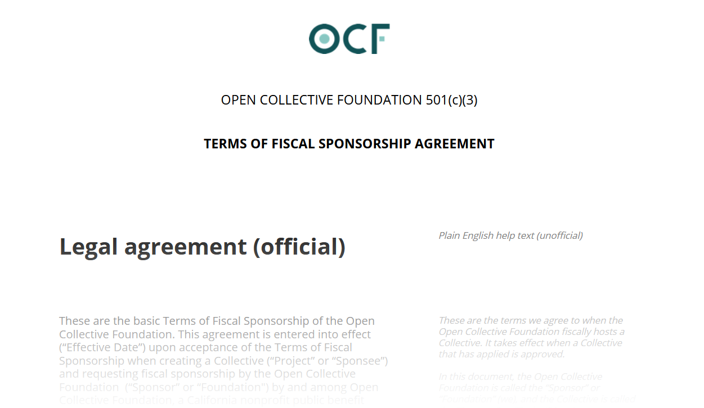

# Terms of Fiscal Sponsorship

Before you host your initiative with Open Collective Foundation, make sure to review our [Terms of Fiscal Sponsorship Agreement](https://docs.google.com/document/u/2/d/e/2PACX-1vQ_fs7IOojAHaMBKYtaJetlTXJZLnJ7flIWkwxUSQtTkWUMtwFYC2ssb-ooBnT-Ldl6wbVhNQiCkSms/pub), the legal agreement that defines the relationship between OCF and a hosted initiative.

It includes a “plain English” version alongside it to help you understand the ins and outs. And we really encourage you to read the whole thing.

For some key highlights of the agreement, see [Processes and Limitations](https://docs.opencollective.foundation/how-it-works/processes-and-limitations). Have any questions? [Reach out to us](mailto:contact@opencollective.foundation).

