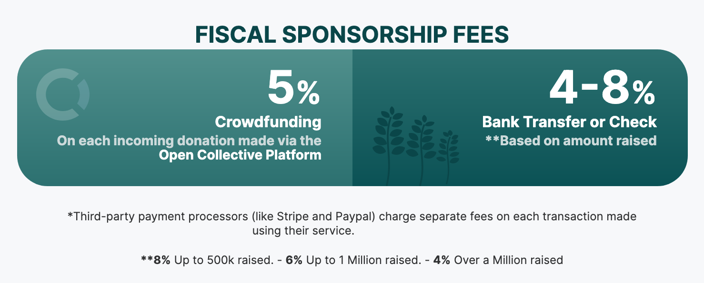

# Fees

To ensure that our services are sustainable and continuously improving, we charge a **Host Fee** on funds contributed to the Collectives we host. Charging fees like this is standard in the fiscal sponsorship world.

There are **no setup fees, balance minimums, monthly or annual fees**, or any other charges. Besides the Host Fee, the only other fees you'll see are payment processor fees charged by Stripe, PayPal, Wise, or other third party services you may opt to pay through.

### How much are the fees?

For groups who have raised up to $500k:

* **5%** **fee on each incoming contribution made via credit card or another method** through your page on Open Collective. These transactions are automated.
* **8% via all other means (like non-platform bank transfers and checks).** This reflects the manual processing we need to do for such transactions.

:seedling: If your Collective raises funds beyond a certain threshold (above $500k; then above $1 million), the fees on non-platform **bank transfers & checks** start to go down. We charge

* **6%** for between $500k and $1 million raised, and
* **4%** if you have raised over $1M


Contributors also have the option to give a “tip” to the Open Collective **platform** when making a contribution. (The **platform** has decided to [not charge fees](https://blog.opencollective.com/open-collective-platform-is-moving-on-to-0-fees-for-charitable-collectives/) for it's usage in charitable Collectives. This is separate from the **host**.) Leaving a "tip" is completely voluntary, and helps support the open-source software that makes our service possible.


### How do the fees compare?

The standard fee for fiscal sponsorship is 5%-15%. Different fiscal sponsors offer different services so it can be hard to directly compare, but we think our rates are quite a good value for the service we offer.

Some people compare our fees with a regular crowdfunding site, which tend to charge 0%-5%, but it's important to remember that these services do not offer [fiscal hosting](../what-we-offer/fiscal-hosting.md), ongoing & recurring donations, or budget transparency. Read more about [what OCF offers](../what-we-offer/) as a fiscal host.

### What do we use fee revenue for?

The purpose of charging a fee is so we can cover our costs continue to improve our services for Collectives. Open Collective Foundation is a 501(c)(3) non-profit, meaning all revenue is invested back into our mission.

Host fees go into our operating budget. It's completely transparent and you're welcome to [view our budget](https://opencollective.com/foundation#category-BUDGET) any time.

A lot of our work is behind the scenes, so to understand why we have to charge fees, it might be useful to know more about our costs.

* The largest expense is **staff**, and people are the most valuable part of our organization.\
  \
  [Our team](../about/team.md) reviews applications to join OCF, processes expense requests, provides user support, responds to your questions and feedback, writes the blog and newsletter, handles partnerships and contracts with funders, assists with grant applications, maintains this documentation, spreads the word about OCF, and continuously improves our features and services. And lots more!
* OCF shares part of our revenue with **Open Collective**, which makes the software platform that enables everything we do. We have a close partnership so that the platform can continue to evolve.
* We need **professional services**, such as lawyers, accountants, and developers. There are a lot of legal, financial, and technical tasks and responsibilities involved in running OCF.
* **Compliance** is an important part of being a 501(c)(3) and fiscal sponsor. It's our job to ensure that all money is used legitimately for public benefit. There are a lot of regulations and laws we have to follow. We have to file taxes with the IRS and undergo extensive independent audits.
* There are also **operational costs** like software subscriptions, office expenses, maintaining our website, etc.


Wondering how Open Collective Foundation’s funds are used? We also use the Open Collective platform, so you can [see our transparent budget for yourself](https://opencollective.com/foundation#category-BUDGET).


### Can we have a discount?

Collectives often ask us for discounts on fees. We wish we could say yes, because we are so inspired by the important work they do, and understand that every dollar counts. People also ask for discounts on bringing in funds already raised before joining OCF. We understand that it can feel odd to pay fees on money you already have.

However, our standard fees are already as lean as we can make them given our very real [costs](fees.md#what-do-we-use-fee-revenue-for). To provide our services and continue to improve them, we need to keep OCF healthy and vibrant for the good of all Collectives we serve. It's also important to remember that most of our costs, and much of the value we provide, are related to holding, managing, and paying out funds over time, not just about fundraising.

So, outside of specific campaigns (like the fee waiver we offered COVID19 response groups at the height of the pandemic), and our standard graduated [discounts on budgets over $500k](fees.md#how-much-are-the-fees), **we are not able to provide any discounts on fees**.
