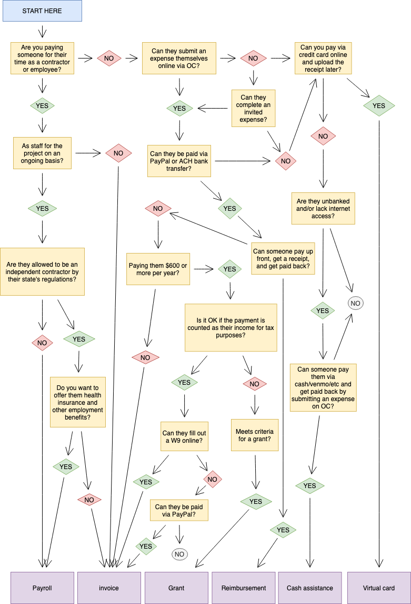

# Payouts

In order to achieve your Collective's mission, you need to spend the money you raise. We are here to facilitate that, and to take care of a lot of the admin for you. OCF functions as your Collective's bank account and we process many kinds of payouts for our hosted groups.

There are a range of ways to pay out funds from your OCF budget, depending on what you're paying for and who you want to pay. Most payouts happen through [Expenses](basics.md#submitting-expenses) on your Open Collective page, but we have also developed other options to meet the needs of our community in specific circumstances.

* [Reimbursement:](https://docs.opencollective.com/help/expenses-and-getting-paid/submitting-expenses#reimbursements) Someone makes a purchase, then uploads the receipt to get paid back via an Expense.
* [Invoice:](https://docs.opencollective.com/help/expenses-and-getting-paid/submitting-expenses#invoices) Paying someone for their time or specific services as a vendor or independent contractor, via an Expense.
* [Virtual card:](../what-we-offer/virtual-cards-policy.md) Like a debit card linked to your Open Collective budget, which you can use to make online purchases. You later upload the receipt to an automatically generated Expense.
* [Cash assistance:](policies/cash-assistance-policy.md) A process for paying people in cash or through apps who can't directly interact with the OC platform because they are unbanked or lack internet access.
* [Grant:](grantmaking/policy.md) Become a grantmaker in your community, enabling financial support that's not taxable as income to the grantee, which doesn't require receipts up front. Paid via Grant Expenses (only enabled for approved groups).
* [Payroll:](../what-we-offer/employment.md) Employ someone on an ongoing basis in a formal part-time or full-time role, which can include benefits like health insurance.

### Limitations

While we try to accommodate every request, we work within some limits defined by IRS rules, human capacity of our staff, and technical limitations.

* OCF will only process payouts approved by an admin of the Collective.
* All expenditures must be allowable under 501(c)(3) regulations.
* We can only pay people in the US in the vast majority of cases.
* OCF makes payments via Paypal, bank transfers, and virtual cards only, because these are integrated with the Open Collective platform.
* We can't make direct payments via cashapp, venmo and similar services (because they don't allow nonprofits like OCF to sign up, among other reasons). See the [outside accounts policy](policies/outside-accounts-policy.md) for how to work through external tools.
* Payouts must be broken down into individual expenses with details about what the money is for—we can't pay out undifferentiated chunks of money (except in some special cases like donations to another 501(c)(3) nonprofit). See the [outside entities policy](policies/outside-entities-policy.md) for more info.
* We have certain paperwork requirements due to IRS rules—we have to collect W9 forms in some cases before we can pay someone, we have to sign a grant contracts, etc. If any of these apply to you, we will let you know.


Want to pay someone who's not yet on the platform? Or maybe you know exactly how much you want to disburse to someone? You can [invite someone to submit an expense](https://docs.opencollective.com/help/expenses-and-getting-paid/submitting-expenses#inviting-a-third-party-to-submit-an-expense). Fill out the payout details for them, they'll receive an email to confirm, and get paid!


Questions about payouts? [Email us](mailto:contact@opencollective.foundation).
